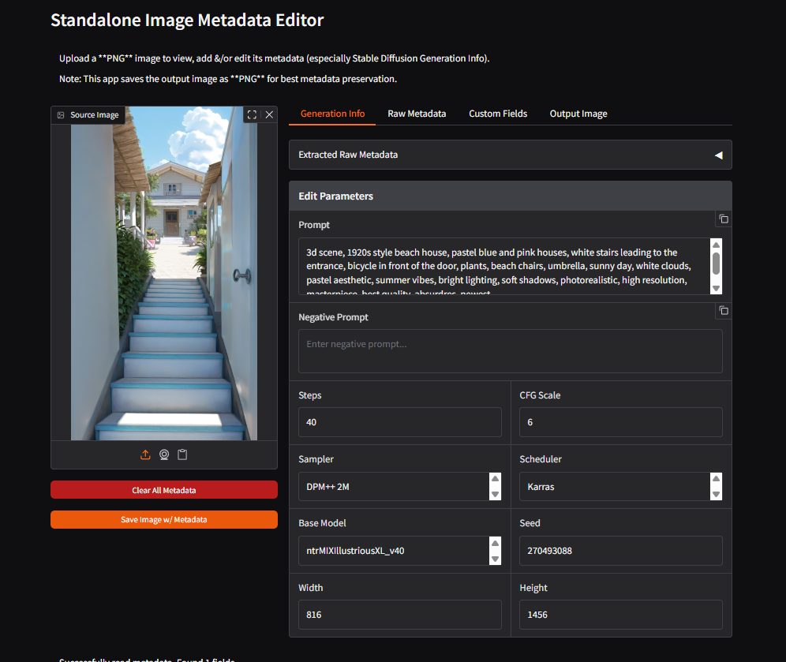

# Image Metadata Editor Forge

A simple & user-friendly extension for Stable Diffusion WebUI Forge that lets you view, edit, add & manage metadata in your Ai-generated or real images.

## Features



This extension helps you:
- **View metadata** stored inside your AI-generated images (like prompts, settings, etc.)
- **Edit existing metadata** or add new info to images
- **Save images** w/ updated metadata
- **Remove all metadata** from images if needed
- **Add custom info** like artist name, notes, or categories

Think of metadata as invisible info stored inside your image files - like the recipe used to create the AI image.

## Installation (Step-by-Step)

1. **Find your Forge folder**: `stable-diffusion-webui-forge` on your computer

2. **Navigate to extensions**: Inside that folder, find & open the `extensions` folder

3. **Download this extension**: 
   - **Easy way**: Download the .zip or .7z from [release page](https://github.com/MackinationsAi/sd-forge-metadata-editor/releases/tag/sd-forge-metadata-editor_v0.0.1), extract it, & put the folder in `extensions`
   - **Git way** (if you have Git installed): Open command prompt/terminal in the extensions folder & run:
     ```
     git clone https://github.com/MackinationsAi/sd-forge-metadata-editor.git
     ```

4. **Restart Forge**: Close Stable Diffusion WebUI Forge completely & start it again

5. **Find the extension**: Look for "Image Metadata Editor" section in your txt2img or img2img tabs (it will be collapsed/closed by default - click to open it)

### Basic Workflow

#### 1. **Upload an Image**
- Click the "Source" image upload area
- Select any image file (PNG, JPEG, etc.)
- Metadata is automatically read & displayed

#### 2. **View Existing Metadata**
The extension automatically displays:
- **Generation Info Tab**: Shows parsed metadata in readable format
- **Nothing found in the image** = No metadata detected
- **Parsed parameters** = Shows prompt, negative prompt, steps, etc.

#### 3. **Edit Parameters**
In the "Generation Info" tab, you can edit:
- **Prompt**: Main generation prompt
- **Negative Prompt**: Negative prompt text
- **Steps**: Number of sampling steps (1-150)
- **CFG Scale**: Classifier guidance scale (1.0-30.0)
- **Sampler**: Sampling method (e.g., "DPM++ 2M")
- **Schedule type**: Sampling schedule (e.g., "Karras")
- **Model**: Model name used
- **Seed**: Generation seed (-1 for random)
- **Size-1 & Size-2**: Image dimensions (width x height)

#### 4. **Add Custom Metadata** (Optional)
In the "Custom Fields" tab:

**Method A - Using Add Button:**
1. Enter a key (e.g., "artist")
2. Enter a value (e.g., "MyUsername")
3. Click "Add" button
4. The key-value pair is added to the image’s metadata JSON

**Method B - Direct JSON Editing:**
1. Edit the JSON directly in the text area:
   ```json
   {
     "artist": "MyUsername",
     "category": "portrait",
     "rating": "5",
     "notes": "My favorite generation"
   }
   ```

#### 5. **Save Your Image**
- Click **"Save w/ Metadata"** 
- The image appears in "Output Image" tab
- Success message shows: "✅ Successfully saved metadata to image!"
- Go to the Output Image tab to download the image

### Advanced Features

#### **Raw Metadata Tab**
- View complete metadata as JSON
- Manually edit any metadata field
- See exactly what's stored in the image
- Useful for debugging or advanced editing

#### **Clear Metadata**
- Click "Clear Metadata" to remove ALL metadata
- Useful for creating clean images for sharing
- Cannot be undone, so save original first

## Troubleshooting

### "Nothing found in the image"
- This means your image has no metadata (completely normal for photos or edited images)
- You can still add metadata & save it w/ that new info

### Extension Not Showing Up
1. Make sure the files are in the right place: `extensions/sd-forge-metadata-editor/scripts/metadata_editor.py`
2. Restart Forge completely (close & reopen)
3. Check the console for error messages

### Can't Save Images
- Make sure you have permission to write files where Forge is installed
- Try w/ a simple prompt first
- Check if your antivirus is blocking file creation

### Custom Fields Not Working
- Make sure your JSON format is correct (the extension will show errors)
- Use simple text w/o special characters when starting out

## FAQ

**Q: Will this work w/ images from other AI tools?**
A: Yes, if they save metadata in standard formats. You can also add metadata to any image.

**Q: Can I use this to organize my image collection?**
A: Yes! Add custom fields like "category", "rating", or "notes" to help organize your images.

**Q: Does this change my original image?**
A: No, it creates a new copy w/ the metadata. Your original stays unchanged. So you have to download the new image w/ metadata to see the changes.

**Q: Why save as PNG instead of JPEG?**
A: PNG preserves metadata much better than JPEG, ensuring your info doesn't get lost.

## How It Works

### Compatibility
- ✅ **Stable Diffusion WebUI Forge**: Primary target platform
- ✅ **AUTOMATIC1111**: Can read A1111 metadata format
- ✅ **Other SD Tools**: Standard metadata format ensures compatibility

### File Structure
```
sd-forge-metadata-editor/
├── README.md                    # This documentation
├── assets/
|   ├── ui.png                   # UI Example
|   └── input_test_image.png     # Input Image Example
└── scripts/
    └── metadata_editor.py       # Main extension code
```

1. **Reading**: Uses `images.read_info_from_image()` (same as Forge's PNG Info tab)
2. **Parsing**: Extracts individual parameters from metadata strings
3. **Editing**: Provides user-friendly form inputs for common parameters
4. **Custom Fields**: JSON-based storage for additional metadata
5. **Saving**: Embeds metadata as PNG text chunks for maximum compatibility

### Adding Metadata to Raw Image
1. Upload a photo or image w/ or w/o metadata
2. Fill in Generation Info fields:
   - Prompt: "beautiful landscape, mountains"
   - Steps: 20
   - CFG Scale: 7.0
   - Sampler: "DPM++ 2M"
3. Add custom fields:
   ```json
   {"source": "original photo", "edited": "2024"}
   ```
4. Click "Save w/ Metadata"

### Can Read Metadata From:
- PNG files w/ embedded metadata
- JPEG files w/ EXIF data
- Images created by Stable Diffusion, AUTOMATIC1111, Forge & ComfyUI

### Supported Formats
- Can read metadata from: PNG (text), JPEG (EXIF), SD formats (Forge, A1111, ComfyUI)
- Saves as: PNG (best for preserving metadata)

## Contributing

This extension is open source. Feel free to:
- Report bugs or issues
- Suggest new features
- Submit pull requests
- Share usage examples

## License

This extension is available under the MIT License.

---

**Version**: 1.0  
**Author**: MackinationsAi  
**Compatibility**: Stable Diffusion WebUI Forge  
**Last Updated**: May 2025
